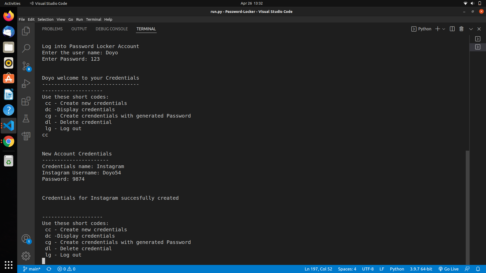

# Password Locker
## BY DOYO ABDIKADIR DOYO

## Description
### This is a Python application that allows a user to generate and store passwords for various accounts.

## Screenshots

## Setup Instructions
### Clone or download and unzip the repository from github, https://github.com/Doyo54/Password-Locker. Then to run the application, open the cloned file in terminal and run the commands:
-  chmod +x run.py
- ./run.py 

## Technologies Used
- Python3.9

## Known Bugs
No known bugs

## Copyright and license information
### The app is open source and in compliance with MIT License Copyright (c) 2022 {Doyo Abdikadir Doyo}

